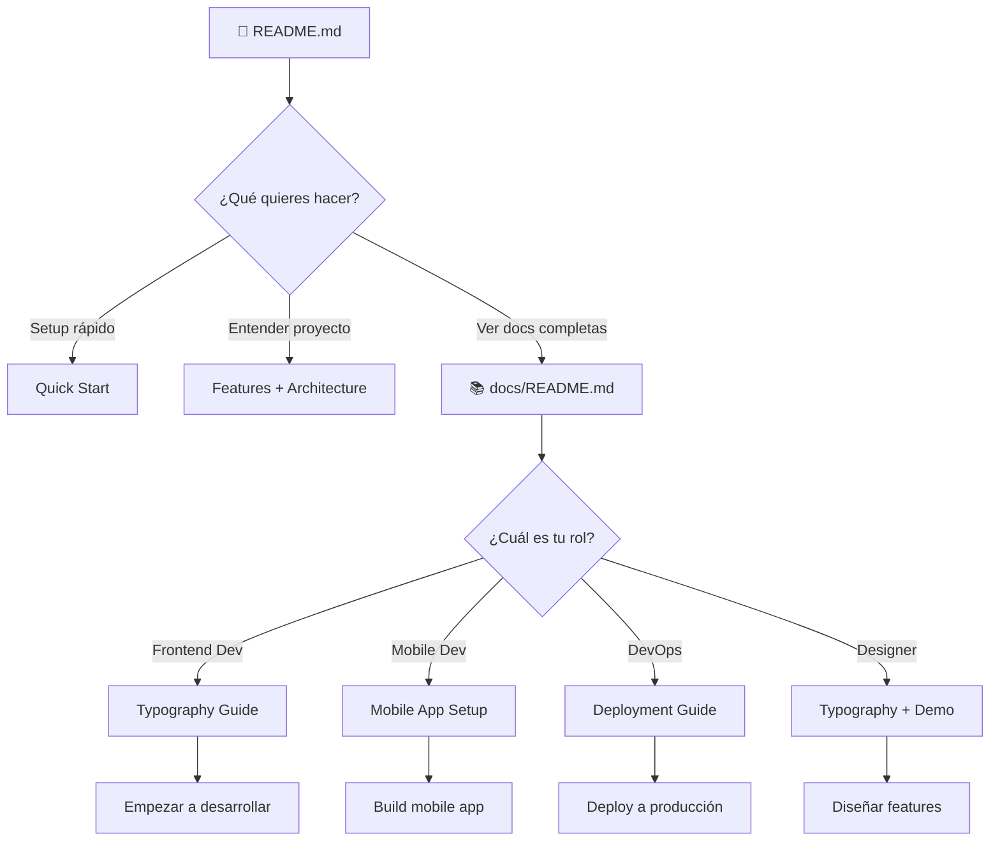
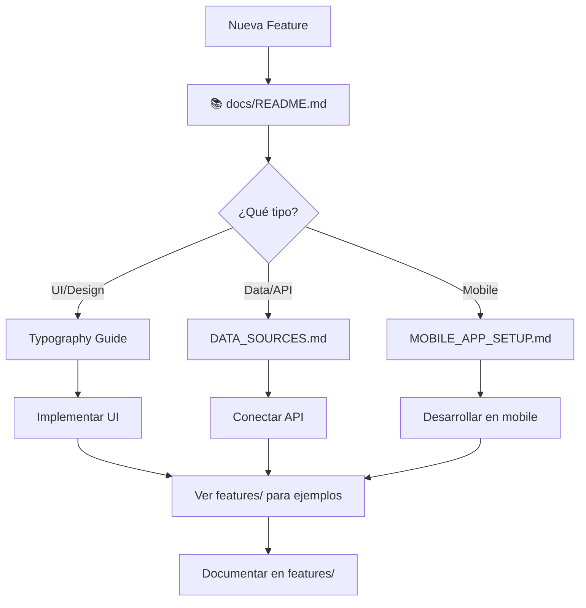

# 📁 Estructura de Documentación

<div align="center">

**Organización completa de todos los documentos del proyecto**

[🏠 README Principal](../README.md) • [📚 Índice](./README.md)

</div>

---

## 🗂️ Estructura Visual

```
lorcana-store/
│
├── 📄 README.md                          # Documento principal del proyecto
│   ├── Quick Start
│   ├── Features Overview
│   ├── Stack Tecnológico
│   ├── API Endpoints
│   ├── Troubleshooting
│   └── Roadmap
│
├── 📚 docs/                              # Centro de documentación
│   │
│   ├── 📄 README.md                      # Índice general de documentación
│   │   ├── Mapa por rol (Frontend, Mobile, DevOps)
│   │   ├── Búsqueda rápida
│   │   └── Guía de convenciones
│   │
│   ├── 📋 ECOSYSTEM_SUMMARY.md          # Resumen del ecosistema
│   │   ├── Overview completo
│   │   ├── Arquitectura
│   │   └── Flujo de datos
│   │
│   ├── 📖 guides/                        # Guías de usuario
│   │   │
│   │   ├── ⚡ QUICK_START_IMPORT.md     # Importar 1,837 cartas
│   │   │   ├── Script automático
│   │   │   ├── Verificación de datos
│   │   │   └── Troubleshooting
│   │   │
│   │   ├── 🎨 TYPOGRAPHY_GUIDE.md       # Sistema tipográfico
│   │   │   ├── Fuentes (Playfair, Garamond, Inter)
│   │   │   ├── Tamaños y pesos
│   │   │   ├── Efectos mágicos
│   │   │   ├── Antes/Después
│   │   │   └── Tips de personalización
│   │   │
│   │   ├── 🌈 COLOR_IMPROVEMENTS.md     # Mejoras de contraste
│   │   │   ├── Análisis WCAG
│   │   │   ├── Antes/Después
│   │   │   ├── Paleta optimizada
│   │   │   └── Guía de personalización
│   │   │
│   │   └── 📊 DATA_SOURCES.md           # Obtener datos de Lorcana
│   │       ├── APIs públicas
│   │       ├── Script de importación
│   │       ├── Estructura de datos
│   │       ├── Transformación
│   │       └── Actualización de precios
│   │
│   ├── ⚙️ setup/                         # Configuración del proyecto
│   │   │
│   │   ├── 📱 MOBILE_APP_SETUP.md       # Setup completo de mobile
│   │   │   ├── Instalación Expo
│   │   │   ├── Componentes principales
│   │   │   ├── Integración backend
│   │   │   ├── OCR y procesamiento
│   │   │   ├── Modo offline
│   │   │   ├── Push notifications
│   │   │   └── Build y deployment
│   │   │
│   │   ├── 🚀 DEPLOYMENT.md             # Deploy a producción
│   │   │   ├── Vercel (Web + Admin)
│   │   │   ├── Database setup
│   │   │   ├── Expo EAS (Mobile)
│   │   │   ├── Variables de entorno
│   │   │   ├── CI/CD
│   │   │   └── Monitoreo
│   │   │
│   │   └── 🔐 ENV_VARIABLES.md          # Guía de variables de entorno
│   │       ├── API Keys
│   │       ├── Database config
│   │       ├── Authentication
│   │       ├── External APIs
│   │       ├── Payment gateway
│   │       ├── Storage
│   │       ├── Analytics
│   │       └── Setup por caso de uso
│   │
│   ├── ✨ features/                      # Features documentados
│   │   │
│   │   └── 🎴 STOCK_FILTER_GUIDE.md    # Filtro Normal/Foil
│   │       ├── Funcionamiento
│   │       ├── Lógica de filtrado
│   │       ├── UI del filtro
│   │       └── Ejemplos de uso
│   │
│   └── 📄 STRUCTURE.md                   # Este archivo
│
├── 📜 scripts/                           # Scripts de utilidad
│   ├── import-lorcana-data.js           # Importar 1,837 cartas de API
│   └── load-to-db.js                    # Cargar a database
│
├── 📱 app/                               # Aplicación Next.js
│   ├── page.tsx                         # Home
│   ├── catalog/                         # Catálogo
│   ├── admin/                           # Dashboard
│   │   ├── page.tsx
│   │   ├── submissions/
│   │   └── logs/
│   └── api/                             # API Routes
│       ├── cards/
│       ├── staging/
│       ├── submissions/
│       ├── updateCards/
│       └── logs/
│
├── 🧩 components/                        # Componentes React
│   ├── header.tsx
│   ├── card-item.tsx
│   ├── card-filters.tsx
│   └── ui/                              # Shadcn UI
│
├── 📚 lib/                               # Librerías y utilidades
│   ├── types.ts                         # TypeScript types
│   ├── mock-data.ts                     # 1,837 cartas
│   ├── imported-cards.json              # Datos de API
│   └── utils.ts
│
└── 🎨 styles/
    └── globals.css                      # Sistema de diseño
```

---

## 📊 Tamaño y Complejidad

| Documento | Tamaño | Tiempo Lectura | Nivel | Status |
|-----------|--------|----------------|-------|--------|
| [README.md](../README.md) | ~420 líneas | 15 min | Básico | ✅ |
| [ECOSYSTEM_SUMMARY.md](./ECOSYSTEM_SUMMARY.md) | ~380 líneas | 10 min | Básico | ✅ |
| [docs/README.md](./README.md) | ~400 líneas | 10 min | Básico | ✅ |
| [QUICK_START_IMPORT.md](./guides/QUICK_START_IMPORT.md) | ~380 líneas | 5 min | Básico | ✅ |
| [TYPOGRAPHY_GUIDE.md](./guides/TYPOGRAPHY_GUIDE.md) | ~600 líneas | 20 min | Intermedio | ✅ |
| [COLOR_IMPROVEMENTS.md](./guides/COLOR_IMPROVEMENTS.md) | ~500 líneas | 15 min | Intermedio | ✅ |
| [DATA_SOURCES.md](./guides/DATA_SOURCES.md) | ~300 líneas | 15 min | Intermedio | ✅ |
| [MOBILE_APP_SETUP.md](./setup/MOBILE_APP_SETUP.md) | ~350 líneas | 2-4 horas | Avanzado | ✅ |
| [DEPLOYMENT.md](./setup/DEPLOYMENT.md) | ~400 líneas | 1-3 horas | Avanzado | ✅ |
| [ENV_VARIABLES.md](./setup/ENV_VARIABLES.md) | ~400 líneas | 10 min | Básico | ✅ |
| [STOCK_FILTER_GUIDE.md](./features/STOCK_FILTER_GUIDE.md) | ~200 líneas | 5 min | Básico | ✅ |
| [QUICK_REFERENCE.md](./QUICK_REFERENCE.md) | ~350 líneas | 10 min | Básico | ✅ |
| [STRUCTURE.md](./STRUCTURE.md) | ~400 líneas | 10 min | Básico | ✅ |

**Total:** ~5,280 líneas de documentación ✨

---

## 🗺️ Mapa de Navegación

### Flujo: Nuevo Usuario → Setup Completo



### Flujo: Developer → Feature Implementation



---

## 📁 Criterios de Organización

### Por Carpeta

#### 📖 `guides/`
**Propósito:** Documentos educativos y de referencia

**Criterios:**
- ✅ Explican conceptos y patrones
- ✅ Enseñan mejores prácticas
- ✅ No son paso-a-paso de setup
- ✅ Pueden ser leídos en cualquier orden

**Ejemplos:**
- Guía de tipografía
- Fuentes de datos
- Arquitectura del sistema
- Patrones de código

---

#### ⚙️ `setup/`
**Propósito:** Instrucciones de configuración e instalación

**Criterios:**
- ✅ Paso-a-paso para configurar algo
- ✅ Requieren seguir un orden específico
- ✅ Incluyen comandos y código
- ✅ Tienen prerequisitos

**Ejemplos:**
- Mobile app setup
- Deployment guide
- Variables de entorno
- Database setup

---

#### ✨ `features/`
**Propósito:** Documentación específica de features implementados

**Criterios:**
- ✅ Documenta una feature específica
- ✅ Explica cómo funciona
- ✅ Incluye código de ejemplo
- ✅ Muestra cómo usar/extender

**Ejemplos:**
- Stock filter
- Cart system
- Authentication
- Search functionality

---

## 🔍 Cómo Encontrar Documentación

### Método 1: Por Palabra Clave

| Buscas... | Ve a... |
|-----------|---------|
| "quick", "importar rápido", "1837" | [QUICK_START_IMPORT.md](./guides/QUICK_START_IMPORT.md) |
| "ecosystem", "overview", "resumen" | [ECOSYSTEM_SUMMARY.md](./ECOSYSTEM_SUMMARY.md) |
| "fuentes", "fonts", "tipografía" | [TYPOGRAPHY_GUIDE.md](./guides/TYPOGRAPHY_GUIDE.md) |
| "color", "contraste", "accesibilidad", "paleta" | [COLOR_IMPROVEMENTS.md](./guides/COLOR_IMPROVEMENTS.md) |
| "importar", "cartas", "data", "api" | [DATA_SOURCES.md](./guides/DATA_SOURCES.md) |
| "mobile", "app", "react native" | [MOBILE_APP_SETUP.md](./setup/MOBILE_APP_SETUP.md) |
| "deploy", "producción", "vercel" | [DEPLOYMENT.md](./setup/DEPLOYMENT.md) |
| "env", "variables", "api keys" | [ENV_VARIABLES.md](./setup/ENV_VARIABLES.md) |
| "filtro", "normal", "foil" | [STOCK_FILTER_GUIDE.md](./features/STOCK_FILTER_GUIDE.md) |

### Método 2: Por Tarea

| Quieres... | Documentos necesarios |
|------------|----------------------|
| **Iniciar el proyecto** | README → Quick Start |
| **Entender el diseño** | TYPOGRAPHY_GUIDE |
| **Importar cartas reales** | DATA_SOURCES |
| **Configurar mobile** | MOBILE_APP_SETUP → ENV_VARIABLES |
| **Desplegar a producción** | DEPLOYMENT → ENV_VARIABLES |
| **Agregar un filtro** | STOCK_FILTER_GUIDE (ejemplo) |

### Método 3: Por Nivel

**🟢 Principiante (0-1 año exp)**
1. README.md
2. docs/README.md
3. ENV_VARIABLES.md
4. STOCK_FILTER_GUIDE.md

**🟡 Intermedio (1-3 años exp)**
1. TYPOGRAPHY_GUIDE.md
2. DATA_SOURCES.md
3. DEPLOYMENT.md (web only)

**🔴 Avanzado (3+ años exp)**
1. MOBILE_APP_SETUP.md
2. DEPLOYMENT.md (full stack)
3. Architecture deep dives

---

## 📝 Convenciones de Nombres

### Archivos

```
✅ UPPER_CASE_SNAKE.md    # Documentación principal
✅ README.md              # Índice de directorio
✅ .env.example           # Archivos de configuración
```

### Emojis en Títulos

```
📄 = Documento individual
📚 = Colección/Índice
📖 = Guía
⚙️ = Setup/Configuración
✨ = Feature
🎨 = Design/UI
📱 = Mobile
🌐 = Web
🔐 = Security
```

---

## 🎯 Roadmap de Documentación

### Completado ✅

- [x] README principal
- [x] Índice de documentación (docs/README.md)
- [x] Guía de tipografía
- [x] Fuentes de datos
- [x] Mobile app setup
- [x] Deployment guide
- [x] Variables de entorno
- [x] Stock filter guide
- [x] Este archivo (STRUCTURE.md)

### Planeado 📋

- [ ] API Reference detallada
- [ ] Database Schema guide
- [ ] Authentication guide
- [ ] Testing guide
- [ ] Contributing guide
- [ ] Changelog
- [ ] Migration guides
- [ ] Performance optimization
- [ ] Security best practices
- [ ] Troubleshooting FAQ

---

## 📊 Estadísticas

### Por Tipo

| Tipo | Cantidad | Líneas Totales |
|------|----------|----------------|
| Guías | 4 | ~1,780 |
| Setup | 3 | ~1,150 |
| Features | 1 | ~200 |
| Índices | 4 | ~1,550 |
| Ecosistema | 1 | ~380 |
| Principal | 1 | ~420 |
| **Total** | **14** | **~5,480** |

### Por Audiencia

| Audiencia | Documentos | Tiempo Total |
|-----------|------------|--------------|
| Frontend Dev | 4 docs | ~1 hora |
| Mobile Dev | 3 docs | ~3 horas |
| DevOps | 3 docs | ~2 horas |
| Designer | 2 docs | ~30 min |
| Product Manager | 2 docs | ~20 min |

---

## 🆘 Necesitas Ayuda?

### No encuentras algo?

1. Busca en [docs/README.md](./README.md)
2. Usa búsqueda por palabra clave (arriba)
3. Pregunta en Discord/Issues

### Quieres agregar documentación?

1. Decide la carpeta correcta (guides/setup/features)
2. Usa el formato estándar
3. Actualiza este archivo (STRUCTURE.md)
4. Actualiza docs/README.md
5. Submit PR

---

## 🎉 Documentación Completa

Con **14 documentos** y **5,480+ líneas**, este proyecto tiene documentación profesional para:

✅ Nuevos developers  
✅ Colaboradores  
✅ DevOps engineers  
✅ Diseñadores  
✅ Product managers  

**Todo está organizado, indexado y fácil de encontrar** 📚✨

---

<div align="center">

**📁 Documentación organizada y accesible 📁**

[⬆ Volver arriba](#-estructura-de-documentación) • [📚 Índice](./README.md) • [🏠 README Principal](../README.md)

</div>

